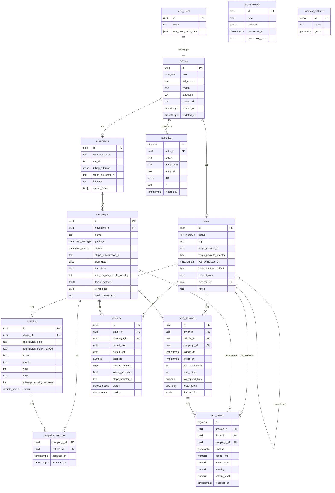

# AdRide — Schemat bazy danych

Fleet advertising platform: kierowcy oklejają auta, reklamodawcy płacą za ekspozycję, GPS śledzi przebieg.

## Szybki start

```bash
# Lokalne środowisko Supabase
supabase start
supabase db reset   # czyści i uruchamia wszystkie migracje
supabase db push    # pushuje do projektu Supabase

# Weryfikacja
psql $DATABASE_URL -c "SELECT COUNT(*) FROM gps_points;"
```

## Struktura migracji

| Plik | Zawartość |
|------|-----------|
| `000001_extensions` | PostGIS, pgcrypto, pg_cron, pg_stat_statements |
| `000002_enums` | Typy: user_role, driver_status, vehicle_status, campaign_package, campaign_status, payout_status |
| `000003_profiles` | Tabela profiles + trigger auth.users → profiles |
| `000004_drivers` | Tabela drivers |
| `000005_advertisers` | Tabela advertisers |
| `000006_vehicles` | Tabela vehicles (z generated column registration_plate_masked) |
| `000007_campaigns` | Tabela campaigns + campaign_vehicles (M:N) |
| `000008_gps_sessions` | Tabela gps_sessions |
| `000009_gps_points` | Tabela gps_points (partycjonowana miesięcznie) + partycje 2026 + pg_cron |
| `000010_payouts` | Tabela payouts (kwoty w groszach BIGINT) |
| `000011_stripe_events` | Tabela stripe_events + audit_log |
| `000012_indexes` | Wszystkie indeksy: BRIN, GiST, B-tree, GIN, partial |
| `000013_functions` | Funkcje: auth helpers, geo agregacje, statystyki, partycje |
| `000014_triggers` | Triggery: updated_at, referral_code, audit, GPS stats enqueue |
| `000015_rls_policies` | Kompletne polityki RLS dla każdej tabeli |
| `000016_views` | Widoki zmaterializowane + harmonogram pg_cron |
| `000017_seed_dev` | Dane deweloperskie: 3 admini, 20 kierowców, 8 reklamodawców, 100k GPS |

---

## ERD (Entity Relationship Diagram)



---

## Skala danych

| Metryka | Wartość |
|---------|---------|
| Punkty GPS / kierowca / dzień | ~10 000 |
| Punkty GPS / 100 kierowców / miesiąc | ~30 000 000 |
| Odczyt GPS | co 12 sekund |
| Partycjonowanie | miesięczne (RANGE na `recorded_at`) |
| Archiwizacja | partycje > 12 miesięcy → Supabase Storage |

## Indeksy kluczowe dla wydajności

| Tabela | Indeks | Typ | Cel |
|--------|--------|-----|-----|
| `gps_points` | `idx_gps_points_recorded_at_brin` | BRIN | Range scans na czasie |
| `gps_points` | `idx_gps_points_location_gist` | GiST | Zapytania przestrzenne |
| `gps_points` | `idx_gps_points_driver_recorded` | B-tree | RLS + historia kierowcy |
| `gps_points` | `idx_gps_points_campaign_recorded` | B-tree | Raporty kampanii |
| `gps_sessions` | `idx_gps_sessions_route_geom` | GiST | Heatmapy tras |
| `campaigns` | `idx_campaigns_vehicle_ids` | GIN | `ANY(vehicle_ids)` lookup |

## Bezpieczeństwo (RLS)

- Każda tabela ma `ENABLE ROW LEVEL SECURITY` + `FORCE ROW LEVEL SECURITY`
- `service_role` ma `BYPASSRLS` — używany wyłącznie przez backend (Stripe webhooks, cron)
- `anon` nie ma żadnych polityk → zero dostępu
- Denormalizacja `driver_id` i `campaign_id` w `gps_points` eliminuje JOIN w politykach RLS

Szczegóły: [docs/rls-test-matrix.md](docs/rls-test-matrix.md)

## Zadania pg_cron

| Nazwa | Harmonogram | Akcja |
|-------|-------------|-------|
| `adride-create-gps-partition` | `5 0 1 * *` | Tworzy partycję na 2 miesiące do przodu |
| `adride-refresh-driver-monthly-stats` | `0 3 * * *` | Odświeża `mv_driver_monthly_stats` |
| `adride-refresh-campaign-dashboard` | `0 * * * *` | Odświeża `mv_campaign_dashboard` |
| `adride-refresh-district-exposure` | `0 4 * * *` | Odświeża `mv_district_exposure` |
| `adride-archive-old-gps-partition` | `0 2 1 * *` | Archiwizuje partycję sprzed 13 miesięcy |

## Archiwizacja partycji

```sql
-- Archiwizacja partycji starszej niż 12 miesięcy
SELECT * FROM archive_gps_partition('2025-01-01');

-- Weryfikacja
SELECT verify_gps_partition_archive('2025-01-01');

-- Przywracanie
SELECT restore_gps_partition('2025-01-01');

-- Status wszystkich partycji
SELECT * FROM v_gps_partition_status;
```

Szczegóły: [scripts/partition_archive.sql](scripts/partition_archive.sql)

## Benchmark

```bash
psql $DATABASE_URL -f scripts/benchmark.sql
```

Cel: SELECT z `gps_points` dla 1 kierowcy w ostatnich 7 dniach < 100ms przy 30M wierszy.

Szczegóły: [scripts/benchmark.sql](scripts/benchmark.sql)
